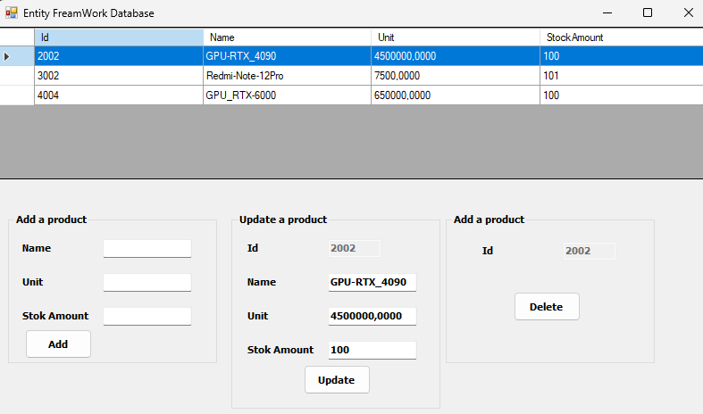

# EntityFrameworkDemo

## Proje Açıklaması

EntityFrameworkDemo, basit bir ürün yönetim sistemi örneğidir. Bu projede Entity Framework kullanarak ürünleri veritabanında yönetebilir (ekleme, silme, güncelleme) ve görüntüleyebilirsiniz. Windows Forms arayüzü ile kullanıcı dostu bir deneyim sunar. Bu proje, Entity Framework ile CRUD (Create, Read, Update, Delete) işlemlerinin nasıl gerçekleştirileceğini gösteren öğretici bir örnektir.

## İçindekiler

1. [Kurulum](#kurulum)
2. [Kullanım](#kullanım)
3. [Sınıf Açıklamaları](#sınıf-açıklamaları)
    - [Form1](#form1)
    - [ProductDal](#productdal)
    - [Product](#product)
    - [ETradeContext](#etradecontext)
4. [Veritabanı](#veritabanı)
5. [Ekran Görüntüleri](#ekran-görüntüleri)
6. [Katkıda Bulunma](#katkıda-bulunma)
7. [Lisans](#lisans)

## Kurulum

1. Bu projeyi yerel makinenize klonlayın:
   ```sh
   git clone https://github.com/kullaniciadi/EntityFrameworkDemo.git
   ```

2. Projeyi Visual Studio ile açın.

3. Gerekli NuGet paketlerini yükleyin:
   ```sh
   Install-Package EntityFramework
   ```

4. [Veritabanı](#veritabanı) bölümündeki adımları takip ederek veritabanınızı oluşturun.

## Kullanım

Projeyi çalıştırdığınızda ana form (Form1) açılacaktır. Burada ürünleri listeleyebilir, ekleyebilir, güncelleyebilir ve silebilirsiniz.

- Ürün eklemek için ilgili alanları doldurup "Add" butonuna tıklayın.
- Ürün güncellemek için listeden bir ürün seçip ilgili alanları düzenleyip "Update" butonuna tıklayın.
- Ürün silmek için listeden bir ürün seçip "Delete" butonuna tıklayın.

## Sınıf Açıklamaları

### Form1

`Form1` sınıfı, ana formun davranışlarını tanımlar. Ürünleri listelemek, eklemek, güncellemek ve silmek için gerekli olan tüm kullanıcı etkileşimlerini yönetir.

```csharp
using System;
using System.Collections.Generic;
using System.ComponentModel;
using System.Data;
using System.Drawing;
using System.Linq;
using System.Text;
using System.Threading.Tasks;
using System.Windows.Forms;

namespace EntityFrameworkDemo
{
    public partial class Form1 : Form
    {
        public Form1()
        {
            InitializeComponent();
        }
        ProductDal _productDal = new ProductDal();
        void LoadProducts()
        {
            dgwProducts.DataSource = _productDal.GetALL();
        }
        private void Form1_Load(object sender, EventArgs e)
        {
            this.Text = "Entity Framework Database";
            dgwProducts.AutoSizeColumnsMode = DataGridViewAutoSizeColumnsMode.Fill;
            dgwProducts.SelectionMode = DataGridViewSelectionMode.FullRowSelect;
            LoadProducts();
        }

        private void dgwProducts_CellEnter(object sender, DataGridViewCellEventArgs e)
        {
            try
            {
                tbxIdU.Text = dgwProducts.CurrentRow.Cells["Id"].Value.ToString();
                tbxIdD.Text = dgwProducts.CurrentRow.Cells["Id"].Value.ToString();
                tbxNameU.Text = dgwProducts.CurrentRow.Cells["Name"].Value.ToString();
                tbxUnitU.Text = dgwProducts.CurrentRow.Cells["Unit"].Value.ToString();
                tbxStockU.Text = dgwProducts.CurrentRow.Cells["StockAmount"].Value.ToString();
            }
            catch (Exception ex)
            {
                MessageBox.Show("Error: " + ex.Message);
            }
        }

        private void btnAdd_Click(object sender, EventArgs e)
        {
            _productDal.Add(new Product
            {
                Name = tbxName.Text,
                StockAmount = Convert.ToInt32(tbxStock.Text),
                Unit = Convert.ToDecimal(tbxUnit.Text)
            });
            LoadProducts();
            MessageBox.Show("New product added!");
        }

        private void btnDel_Click(object sender, EventArgs e)
        {
            _productDal.Delete(new Product { Id = Convert.ToInt32(tbxIdD.Text) });
            LoadProducts();
            MessageBox.Show("Product deleted!");
        }

        private void btnUpdate_Click(object sender, EventArgs e)
        {
            _productDal.Update(new Product
            {
                Id = Convert.ToInt32(tbxIdU.Text),
                Name = tbxNameU.Text,
                StockAmount = Convert.ToInt32(tbxStockU.Text),
                Unit = Convert.ToDecimal(tbxUnitU.Text)
            });
            LoadProducts();
            MessageBox.Show("Product updated!");
        }
    }
}
```

### ProductDal

`ProductDal` sınıfı, Entity Framework kullanarak veritabanı işlemlerini gerçekleştirir. Ürünleri listelemek, eklemek, güncellemek ve silmek için gerekli metodları içerir.

```csharp
using System;
using System.Collections.Generic;
using System.Linq;
using System.Text;
using System.Threading.Tasks;
using System.Data.Entity;

namespace EntityFrameworkDemo
{
    class ProductDal
    {
        public List<Product> GetALL()
        {
            using (ETradeContext context = new ETradeContext())
            {
                return context.Products.ToList();
            }
        }

        public void Add(Product product)
        {
            using (ETradeContext context = new ETradeContext())
            {
                var entity = context.Entry(product);
                entity.State = EntityState.Added;
                context.SaveChanges();
            }
        }

        public void Update(Product product)
        {
            using (ETradeContext context = new ETradeContext())
            {
                var entity = context.Entry(product);
                entity.State = EntityState.Modified;
                context.SaveChanges();
            }
        }

        public void Delete(Product product)
        {
            using (ETradeContext context = new ETradeContext())
            {
                var entity = context.Entry(product);
                entity.State = EntityState.Deleted;
                context.SaveChanges();
            }
        }
    }
}
```

### Product

`Product` sınıfı, ürün nesnesinin özelliklerini tanımlar. Her ürünün bir kimlik numarası (Id), adı (Name), birim fiyatı (Unit) ve stok miktarı (StockAmount) vardır.

```csharp
using System;
using System.Collections.Generic;
using System.Linq;
using System.Text;
using System.Threading.Tasks;

namespace EntityFrameworkDemo
{
    public class Product
    {
        public int Id { get; set; }
        public string Name { get; set; }
        public decimal Unit { get; set; }
        public int StockAmount { get; set; }
    }
}
```

### ETradeContext

`ETradeContext` sınıfı, veritabanı ile bağlantıyı ve veritabanı işlemlerini yönetir. `DbSet<Product>` özelliği, `Products` tablosuyla etkileşim kurar.

```csharp
using System;
using System.Collections.Generic;
using System.Linq;
using System.Text;
using System.Threading.Tasks;
using System.Data.Entity;

namespace EntityFrameworkDemo
{
    class ETradeContext : DbContext
    {
        public DbSet<Product> Products { get; set; }
    }
}
```

## Veritabanı

Bu projede kullanılan veritabanı dosyasının yolu: `Database/ETrade.dacpac`. Bu dosyayı kullanarak veritabanınızı oluşturabilirsiniz.

### Veritabanı Kurulumu

1. SQL Server Management Studio (SSMS) veya benzeri bir araç kullanarak SQL Server'a bağlanın.

2. `Database/ETrade.dacpac` dosyasını kullanarak veritabanınızı dağıtın:
   - SSMS'de "Veritabanları" üzerinde sağ tıklayın ve "Veritabanını Alma" seçeneğini seçin.
   - Açılan pencerede `ETrade.dacpac` dosyasını seçin ve yönergeleri izleyerek veritabanınızı oluşturun.

## Ekran Görüntüleri



## Katkıda Bulunma

Katkıda bulunmak için lütfen [CONTRIBUTING.md](CONTRIBUTING.md) dosyasına bakın.

## Lisans

Bu proje MIT Lisansı ile lisanslanmıştır - detaylar için [LICENSE.md](LICENSE) dosyasına bakın.
```

Bu güncellenmiş README dosyası, veritabanı dosyasının yolunu ve nasıl kullanılacağını da içermektedir. Böylece kullanıcılar, gerekli veritabanını oluşturmak için bu dosyayı kullanabilirler.
